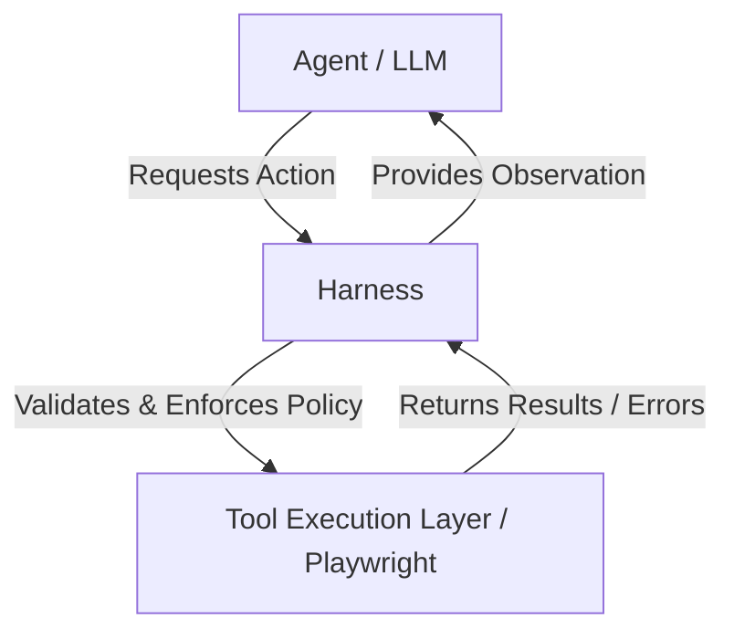

# Agent Harness Learning Project

This project demonstrates a rigorous **Agent Harness architecture** from scratch. 
Instead of relying on heavy orchestration frameworks like LangChain, LangGraph, or CrewAI, this project implements a transparent control layer designed to interface a deterministic environment (Playwright/Browser) with a non-deterministic agent (LLM).

---

## 1. What an Agent is
An autonomous **Agent** uses a Large Language Model (LLM) as its reasoning engine. Given a goal, it decides:
- Which actions to take.
- What order to execute them in.
- How to evaluate observations resulting from those actions.

Unlike a simple script, an agent does not follow a predefined tree of instructions; it dynamically interprets the state of the world (e.g., the browser page) and determines the best course of action.

## 2. What an Agent Harness is
An **Agent Harness** is the strict boundary layer surrounding the Agent. It controls the lifecycle, enforcing rules, validation, and safety. 
If the Agent is the "brain", the Harness is the "nervous system and skeleton". The Harness is entirely deterministic and ensures that the agent cannot break rules, loop infinitely, or perform unsafe actions.

## 3. Why Playwright?
**Playwright** provides robust, programmable control over modern web browsers. It natively handles JavaScript evaluation, element selectors, and timeouts. This makes it an ideal environment to test an agent's ability to navigate, parse, and interact with complex web UI dynamically.

## 4. Agent vs. Automation
An **Automation script** says: `Go to example.com -> wait for load -> click #button -> assert text == "Success"`.
An **Agent** says: `My goal is to find the success message. I am at example.com. What do I see? I see a button. I will click the button. Now what do I see? I see "Success". The goal is met.`
The automation breaks if the button ID changes. The agent realizes the ID changed, looks at the page text, finds an equivalent button, and adapts.

## 5. Harness Architecture
The System is strictly delimited:



The Harness encompasses:
- Validation (Are the tool arguments correct?)
- Policy/Safety Check (Is the URL allowed? Is this action risky?)
- Retry Execution (Did it fail? Can it be retried?)
- Evaluation (Has the maximum step limit been reached?)
- State storage.

## 6. Tool Calling
Tools are rigidly defined in a `ToolRegistry`. The Agent cannot inject arbitrary code. It requests a predefined JSON payload for tools like `open_page` or `click`.

## 7. State Management
`AgentState` holds explicit properties: Goal, History, Step limit, Max retries, Current URL, and execution Status. State is tracked deterministically in the harness, not merely inferred from the LLM conversation window.

## 8. Safety Policies
The `policies.py` modules intercepts actions *before* execution. For instance, if `open_page` is called for a domain outside `ALLOWED_DOMAINS`, the tool is immediately blocked. Risky actions (like `submit_form`) throw a flag for human approval. The LLM cannot override this via its prompt.

## 9. Retry Strategy & 10. Failure Classification
When an action fails, `RetryManager` intercepts the Exception.
- **Recoverable (Element not found):** Retry counter increments.
- **Timeout:** Retry counter increments.
- **Policy/Safety:** Immediately block. Do not retry.
If retries run out, the harness evaluates whether to fail the entire run. Errors are passed explicitly as observations to the agent so it can adjust (e.g., trying a different selector).

## 11. Observation Loop
After every action or failure, a structured JSON observation is recorded.
`ACT -> OBSERVE (Harvested by Playwright via Harness) -> EVALUATE (Check goals/max steps) -> REASON (Next iteration)`

## 12. Stop Conditions
The Harness ends execution if:
- The Agent selects `finish`.
- `MAX_STEPS` are reached (Infinite Loop prevention).
- The task fails irreparably.

## 13. How to run the project
```bash
# We recommend using uv
uv venv
# Windows
.venv\Scripts\activate
# Install requirements
uv pip install -r requirements.txt
python -m playwright install chromium

# Run the app
python main.py
```

## 14. How to run tests
```bash
pytest tests/
```

## 15. Example Execution
Run `main.py`. The console will display the step-by-step cycle. You will see:
1. Agent asks to open `example.com`
2. Agent asks to open a blocked domain -> Blocked by Policy.
3. Agent uses a bad selector -> Handled by Retry System.
4. Agent attempts a risky tool -> Handled by Policy Approval mock.

## 16. Known Limitations
- V1 does not have a real LLM implementation; it uses a rigid Mocking system to demonstrate harness behavior deterministically.
- HTML context trimming is naive (simply taking `innerText[:1000]`).
- The Evaluator simply trusts the agent when it says `finish`, instead of programmatically evaluating the final state against the goal prompt.

## 17. Future Improvements (V2 Roadmap)
- Implement a real provider (Anthropic, OpenAI) via LiteLLM using structured JSON generation schema enforcement.
- Introduce DOM simplification / Accessibility tree serialization to give the agent a clean, machine-readable view of the screen.
- Improve evaluator using a 2nd LLM context specifically designed to verify goals against observations.
- Advanced memory integration (Short-term memory windowing + Vector DB for long term rules).
